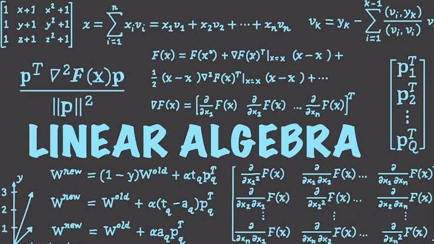
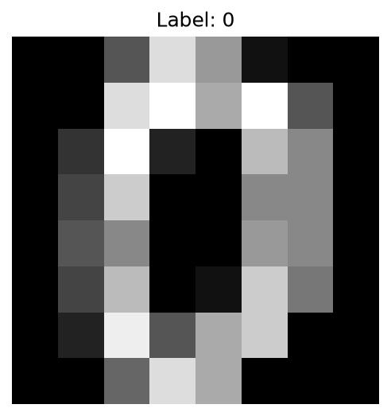
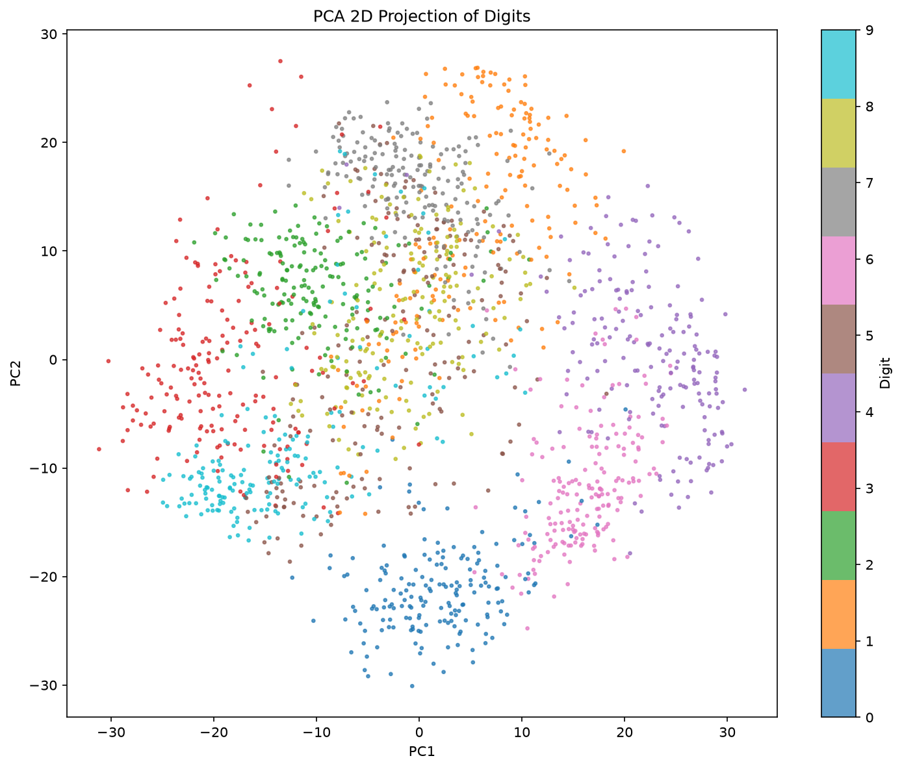
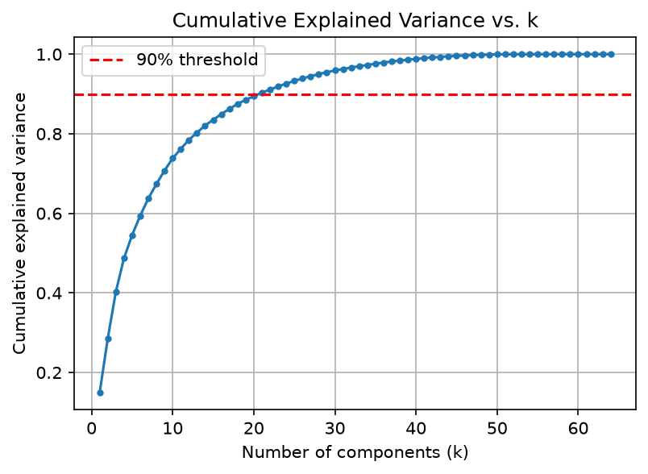
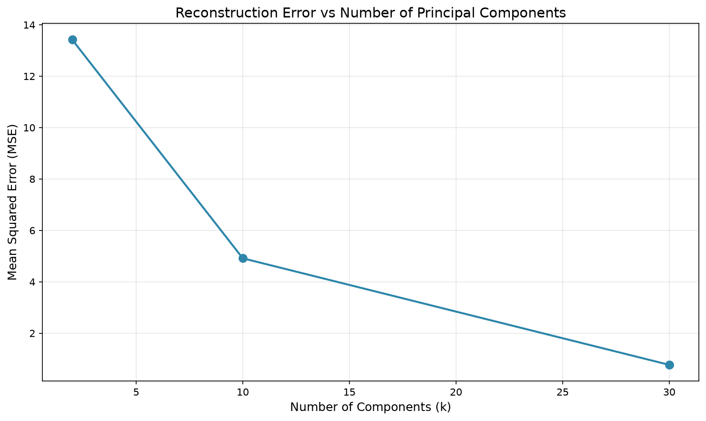

# 📘 Linear Algebra Final Project — Principal Component Analysis (PCA)

<p align="center">
  
</p>

<p align="center">
<b>Principal Component Analysis (PCA) implemented completely from scratch using only Linear Algebra concepts.</b>
</p>

<p align="center">


</p>

---

# 📖 About The Project

This repository contains the final project for the **Linear Algebra** course at **Bu-Ali Sina University**.

The goal of this project is to implement **Principal Component Analysis (PCA)** entirely from scratch without using any ready-made PCA implementations.

Every stage of the algorithm is developed manually using only fundamental Linear Algebra concepts, demonstrating how mathematical theory forms the foundation of modern Machine Learning techniques.

---

# ✨ Features

- 📊 PCA implemented completely from scratch
- 📐 Data Centering
- 📈 Covariance Matrix computation
- 🔢 QR Iteration demonstration
- 🧮 Eigenvalue & Eigenvector analysis
- 📉 Explained Variance Ratio
- 📊 Cumulative Variance visualization
- 🎯 Dimensionality Reduction
- 🔄 Image Reconstruction
- 📏 Reconstruction Error (MSE)
- 🧠 Rank & Null Space analysis
- 📚 Mathematical explanation for every implementation step

---

# 🎯 Topics Covered

- Vector Spaces
- Basis & Change of Basis
- Linear Independence
- Rank
- Null Space
- Orthogonality
- Covariance Matrix
- QR Decomposition
- Eigenvalues
- Eigenvectors
- Matrix Diagonalization
- Principal Component Analysis (PCA)

---

# 📂 Datasets

## Main Dataset

**Digits Dataset (scikit-learn)**

- Samples: **1797**
- Features: **64**
- Classes: **10**
- Image Size: **8 × 8**

Each digit image is represented as a vector in **ℝ⁶⁴**.

---

## ⭐ Bonus Dataset

**MNIST Dataset**

As the bonus section of the project, the complete PCA pipeline is also applied to the **MNIST** dataset.

- Samples: **70,000**
- Features: **784**
- Classes: **10**
- Image Size: **28 × 28**

The results are compared with the Digits dataset to analyze the behavior of PCA on higher-dimensional data.

---

# 📊 PCA Pipeline

```text
Load Dataset
      │
      ▼
Center Data
      │
      ▼
Covariance Matrix
      │
      ▼
Eigen Decomposition
      │
      ▼
Sort Eigenvalues
      │
      ▼
Explained Variance
      │
      ▼
Projection
      │
      ▼
Dimensionality Reduction
      │
      ▼
Reconstruction
      │
      ▼
Reconstruction Error
```

---

# 📐 Mathematical Formulation

### Data Centering

```text
B = X − μ
```

### Covariance Matrix

```text
C = (1/m) BᵀB
```

### Eigen Decomposition

```text
C = QΛQᵀ
```

### Projection

```text
T = BW
```

### Reconstruction

```text
B_reconstructed = TWᵀ + μ
```

---

# 📸 Results Preview

<p align="center">




</p>

<p align="center">




</p>

> **Note:** These figures will be generated automatically after running the project.

---

# 📂 Project Structure

```text
Linear_Algebra/
│
├── pics/
│   ├── linear_algebra.jpeg
│   ├── sample_digit.png
│   ├── explained_variance.png
│   ├── pca_projection.png
│   └── reconstruction.png
│
├── src/
│   ├── main.py
│   ├── pca.py
│   ├── qr.py
│   ├── reconstruction.py
│   ├── visualization.py
│   └── utils.py
│
├── data/
│   ├── centered_data.npy
│   ├── eigenvalues.npy
│   ├── eigenvectors.npy
│   ├── projection_matrix_W.npy
│   ├── reconstructed_data_k2.npy
│   ├── reconstructed_data_k10.npy
│   ├── reconstructed_data_k30.npy
│   └── transformed_data_k10.npy
│
├── report/
│   └── Report.pdf
│
├── requirements.txt
├── README.md
└── .gitignore
```

---

# ⚙️ Installation

Clone the repository

```bash
git clone https://github.com/AbolfazlAsali/Linear_Algebra.git

cd Linear_Algebra
```

Install the required packages

```bash
pip install -r requirements.txt
```

---

# 📦 requirements.txt

```text
numpy>=2.0
matplotlib>=3.9
scikit-learn>=1.7
```

---

# ▶️ Run

```bash
python src/main.py
```

---

# 🚫 Project Restrictions

According to the project requirements:

### ✅ Allowed

- NumPy
- Matplotlib
- sklearn.datasets
- numpy.linalg.eigh

### ❌ Not Allowed

- sklearn.decomposition.PCA
- Any ready-made PCA implementation

---

# 📈 Outputs

Running the project generates:

- Sample digit visualization
- Covariance Matrix
- Eigenvalues & Eigenvectors
- Explained Variance Ratio
- Cumulative Variance Plot
- 2D PCA Projection
- Image Reconstruction
- Reconstruction Error Curve
- MNIST Comparison (Bonus)

---

# 👤 Author

<div align="center">

<a href="https://github.com/AbolfazlAsali">
<br>
<b>Abolfazl Asali</b>
</a>

</div>

---

# 📜 License

This repository contains the final project for the **Linear Algebra** course at **Bu-Ali Sina University** and is shared for educational purposes.

---

<p align="center">

<b>Linear Algebra is the language of Machine Learning.</b>

</p>